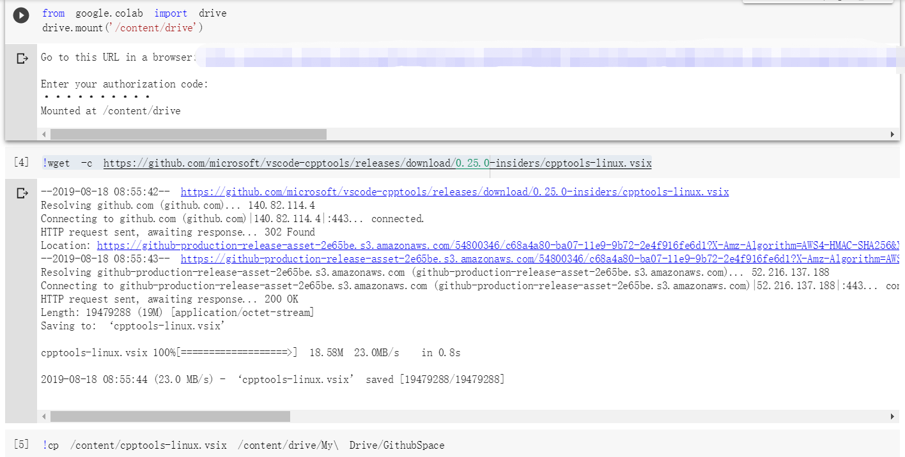

## 问题1：虚拟机VMware Workstation Pro 12安装、更新及Ubuntu安装

缺少必要的组件，安装ubuntu16.04.06，我服了，居然一直因为没有更新的原因不能安装。

### ubuntu 16.04 安装流程

1. 首先在VMware Workstation中新建虚拟机


2. 添加```ubuntu-16.04.4-desktop-amd64```,```ubuntu-16.04.6-desktop-amd64```,```ubuntu-18.04.3-desktop-amd64```中任意一个，我这里延用了之前老机子双系统时使用的16.04.6版本


3. 然后一路确定，内存设置4g，cpu为2*2，以及20g存储空间，其他设置保持默认，安装完成后自动进入登陆页面：


4. 主界面如下：


### ubuntu 第一次使用环境配置

##### 1. 配置国内高速apt-get更新源

[清华大学开源软件镜像站](https://mirrors.tuna.tsinghua.edu.cn/help/ubuntu/)使用帮助：

```
-- https://mirrors.tuna.tsinghua.edu.cn/help/ubuntu/
```
16.04 LTS：Ubuntu 的软件源配置文件是```/etc/apt/sources.list```。将系统自带的该文件做个备份，将该文件替换为下面内容，即可使用 TUNA 的软件源镜像。**或者**打开System Settings，选择Software & Updates，将Download from下拉框Server for United States改选为china, ```mirrors.tuna.tsinghua.edu.cn```，等待Updating后即可。

##### 2. language support

打开System Settings，选择Language Support，由于新安装的系统中没有汉语（中文）选项，所以选择install/Remove按钮，添加Chinese(simplified)。然后在语言菜单列表中把汉语（中文）左键拖至第一行，单机Apply System-Wide后重启即可。

开机后，个人喜好保持英文路径名称。

##### 3. 安装日常使用软件

参考[ubuntu16.04纯净系统配置安装集锦](https://blog.csdn.net/qq_29630271/article/details/79042327)
- vim编辑器
```
sa@Ubuntu:~$ sudo apt-get install vim
```
- [搜狗输入法](https://pinyin.sogou.com/linux/)下载地址
```
sa@ubuntu:~/Downloads/soft_from_win$ sudo apt-get -f install
sa@ubuntu:~/Downloads/soft_from_win$ sudo dpkg -i sogoupinyin_2.2.0.0108_amd64.deb
```
- [git]()
```
sa@ubuntu:~$ sudo apt-get install git
```
- [unrar]()
```
sa@ubuntu:~$ sudo apt-get install unrar
```
- 把左侧栏目移到下面
```
gsettings set com.canonical.Unity.Launcher launcher-position Bottom
```

##### 4. 常用Linux指令
```
$ mkdir filedir
```

<div id="postcomments"   >
<p><strong>mv 操作文件时是移动并且重命名。</strong></p>

<p>目标目录与原目录一致，指定了新文件名，效果就是仅仅重命名。</p>
<pre>mv  /home/ffxhd/a.txt   /home/ffxhd/b.txt    </pre>
<p>目标目录与原目录不一致，没有指定新文件名，效果就是仅仅移动。</p>
<pre>mv  /home/ffxhd/a.txt   /home/ffxhd/test/ 
或者
mv  /home/ffxhd/a.txt   /home/ffxhd/test </pre>

<p>目标目录与原目录一致, 指定了新文件名，效果就是：移动 + 重命名。</p>
<pre>mv  /home/ffxhd/a.txt   /home/ffxhd/test/c.txt</pre>
<p>------------------------------------------------------</p>
<p>批量移动文件和文件夹：(在Ubuntu 18.04 奏效）</p>
<p>例如，将 <strong>/home/ffxhd/testThinkPHP5/tp5</strong> 目录里边的所有文件&文件夹   挪到  <strong>/home/ffxhd/testThinkPHP5</strong> </p>
<pre>mv  /home/ffxhd/testThinkPHP5/tp5/*  /home/ffxhd/testThinkPHP5</pre>
<p>注意：需要先执行显示隐藏文件命令，否则，隐藏文件以及隐藏文件夹不会被移动到新目录。</p>
<p>英语点号开头的文件会被作为隐藏文件处理，英语点号开头的文件夹也被作为隐藏文件夹处理。</p>
<p>例如：文件 <span class="marked">.a.txt</span>， 目录 <span class="marked">.tp5</span>。</p>
	<div class="pagenav">
			</div>
</div>


## 问题二：[FreeNos](http://www.freenos.org/)-Linux-Ubuntu[配置过程](https://github.com/nieklinnenbank/FreeNOS)

- **环境设置**

    首先，安装所有必要的build依赖项，具体有SCins，C++ compiler和一个针对Intel处理器的ISO镜像生成工具

    使用以下方法更新系统存储库缓存并安装所需的开发工具（Update your system repository cache and install the required development tools using）：

    ```
    $ sudo apt-get update
    $ sudo apt-get install build-essential scons genisoimage xorriso qemu-system
    ```
    如果您的Ubuntu主机是64位的，您需要安装gcc multilib包来交叉编译32位体系结构（If your Ubuntu host is 64-bit, you need to install the GCC multilib package to cross compile for the 32-bit architecture）：
    ```
    $ sudo apt-get install gcc-multilib g++-multilib
    ```
    或者，也可以安装llvm/clang编译器（Alternatively, you can install the LLVM/Clang compiler as well）：
    ```
    $ sudo apt-get install clang
    ```
- **Building FreeNos**

    ```
    //To run the autotester of FreeNOS on the host OS, run:
    $ scons test
    //To run the same autotester on FreeNOS under Qemu, run:
    $ scons qemu_test
    //To start FreeNOS in a Qemu virtual machine with a serial console, use the following command:
    $ scons qemu
    //Open two terminals. In the first terminal, launch FreeNOS in Qemu with the internal gdbserver enabled:
    $ scons qemu_debug
    ```

## 问题三：代码阅读以及vscode安装

### Install VS code on window

包含VS code编译器安装和C\C++环境配置（以后再写，先用vs2019讲究着吧）

安装过程很简单，[参考这篇博客就ok了----Ubuntu 16.04 安装VSCode](<https://blog.csdn.net/Among12345/article/details/81874117>)

但是在```Updating C/C++ dependencies```出现网络问题，但是事实上网络是ok的，应该是VS code的问题，这里采用官方解决方案。

```
[打开官方链接，下载cpptools-linux.vsix,再一次根据官方建议：
Downloading package 'C/C++ language components (Linux / x86_64)'  Failed. Retrying... Failed. Retrying... Failed. Retrying...Waiting 8 seconds... Failed. Retrying...Waiting 16 seconds... Failed. Retrying... Done!
Downloading package 'ClangFormat (Linux / x86_64)'  Failed. Retrying... Failed. Retrying... Failed. Retrying...Waiting 8 seconds... Failed. Retrying...Waiting 16 seconds... Failed. Retrying... Done!
Downloading package 'Mono Framework Assemblies'  Failed. Retrying... Failed. Retrying... Failed. Retrying...Waiting 8 seconds... Failed. Retrying...Waiting 16 seconds... Failed. Retrying... Done!
Downloading package 'Mono Runtime (Linux / x86_64)'  Failed. Retrying... Failed. Retrying... Failed. Retrying...Waiting 8 seconds... Failed. Retrying...Waiting 16 seconds... Failed. Retrying... Done!

Installing package 'C/C++ language components (Linux / x86_64)'
Failed at stage: installPackages
Error: end of central directory record signature not found

If you work in an offline environment or repeatedly see this error, try downloading a version of the extension with all the dependencies pre-included from https://github.com/Microsoft/vscode-cpptools/releases, then use the "Install from VSIX" command in VS Code to install it.
```

[打开[官方链接](https://github.com/Microsoft/vscode-cpptools/releases)，下载[cpptools-linux.vsix](https://github.com/microsoft/vscode-cpptools/releases/download/0.25.0-insiders2/cpptools-linux.vsix),再一次根据官方建议：

```
Set the "C_Cpp.updateChannel" setting to "Insiders" to auto-install the latest Insiders vsix. Or if that doesn't work (such as in the remote scenario), manually download the vsix that matches the target OS and run the "Install from VSIX" command in VS Code.
```
校园网在github下东西就是一种煎熬！！！

事实上还是有两个复杂的解决方案：

1. 威屁嗯

2. 谷歌访问助手+谷歌drive+colab（这里就以后有时间再细说）

   - 这里就贴一张图有兴趣的朋友可以自己去研究

     
     

将下载的vsix文件放在便于管理的文件夹下，在VS code中打开扩展视图命令下拉菜单输入```install from VSIX```然后安装即可，so easy。

### Code Read

因为没学过操作系统底层，所以没有什么兴趣从内存管理开始看。退而求其次，先看简单的指令吧。

#### ls（当然从最简单的开始看啦）

通过**ListFiles**，初始化**ls**的**Description**、**Positional**、**Flag**、**Version**等等

```
    parser().setDescription("List files on the filesystem");
    parser().registerPositional("FILE", "Target file to list", 0);
    parser().registerFlag('l', "long", "List files in long output format");
    parser().registerFlag('a', "all", "List all files on the filesystem");
```


- **Application.h**

```c++
/** Program argument parser object */
ArgumentParser m_parser;
    
/** Parsed Arguments */
ArgumentContainer m_arguments;

/** Input argument count */
int m_argc;

/** Input argument values */
char ** m_argv;

/** Program version */
String m_version;

Application::Application(int argc, char **argv)
{
    m_argc = argc;
    m_argv = argv;
    m_parser.registerFlag('h', "help", "show program help");
    m_parser.registerFlag('v', "version", "show program version");
    m_parser.registerFlag('d', "debug", "set log level to debug");
}
```

- **ArgumentParser.h**

```c++

/** Contains all registered flag arguments by name. */
HashTable<String, Argument *> m_flags;

/** Contains all registered flag arguments by single character identifier. */
HashTable<String, Argument *> m_flagsId;

/** Contains all registered positional arguments. */
Vector<Argument *> m_positionals;

/** Program name */
String m_name;

/** Program description */
String m_description;

ArgumentParser::ArgumentParser()
{
    m_name = "PROGNAME";
    m_description = "program description";
}
```

- **Argument.h**

```c++
/** Argument identifier */
char m_id;

/** Argument name */
String m_name;

/** Argument description in a single line */
String m_description;

/** Optional argument value */
String m_value;

/** Maximum argument count */
    Size m_count;

Argument::Argument(const char *name)
    : m_id(0)
    , m_name(name)
    , m_count(0)
{
}

Argument::Argument(const String & name)
    : m_id(0)
    , m_name(name)
    , m_count(0)
{
}
```

- **ArgumentContainer.h**

```c++
/** Contains all flag arguments. */
HashTable<String, Argument *> m_flags;

/** Contains all positional arguments. */
Vector<Argument *> m_positionals;

ArgumentContainer::ArgumentContainer()
{
}

ArgumentContainer::~ArgumentContainer()
{
    // cleanup flags
    for (HashIterator<String, Argument *> it(m_flags);
         it.hasCurrent();)
    {
        delete it.current();
        it.remove();
    }

    // cleanup positionals
    for (Size i = 0; i < m_positionals.count(); i++)
        delete m_positionals[i];
}

```

- **子类父类虚函数的关系**

```c++
ListFiles::Result ListFiles::exec()
{
    const Vector<Argument *> & positionals = arguments().getPositionals();
    Result result = Success, ret = Success;

    // Refresh mountpoints on the filesystem first
    refreshMounts(0);

    // List files provided on the command-line, if any
    if (positionals.count() > 0)
    {
        for (Size i = 0; i < positionals.count(); i++)
        {
            result = printFiles(positionals[i]->getValue());

            // Update the return result
            if (result != Success)
            {
                ret = result;
            }
        }
    }
    // Otherwise, list the current directory
    else
    {
        char path[PATH_MAX];
        getcwd(path, sizeof(path));

        ret = printFiles(path);
    }

    // Done
    return ret;
}

virtual Result Application::exec() = 0;

int Application::run()
{
    ...
    if (exec() == Success)
        return ExitSuccess;
    ...
}
```


## 内存管理

空间大小定义

```
/** Convert kilobytes to bytes */
#define KiloByte(v) ((v) * 1024)

/** Convert megabytes to bytes */
#define MegaByte(v) ((v) * 1024 * 1024)

/** Convert gigabytes to bytes */
#define GigaByte(v) ((v) * 1024 * 1024 * 1024)
```

初始化一个3M的内存空间

```
Kernel::heap(MegaByte(3),
            MegaByte(1));
```

其中初始化堆的定义：```static Error heap(Address base, Size size)```

“This function sets up the kernel heap for dynamic memory allocation with new() and delete() operators. It must be called before any object is created using new().”意思是说，所有Kernel对像创建时，都需要通过new()和delete()操作为内核分配一个动态内存。