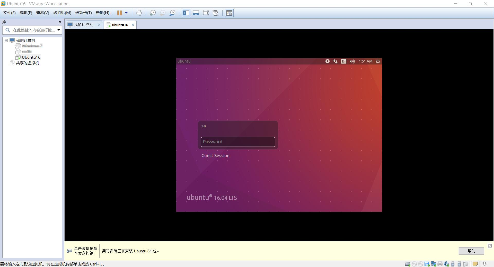

## 问题1：虚拟机VMware Workstation Pro 12更新

缺少必要的组件，安装ubuntu16.04.06，我服了，居然一直因为没有更新的原因不能安装。

### ubuntu 16.04 安装流程

1. 首先在VMware Workstation中新建虚拟机


2. 添加```ubuntu-16.04.4-desktop-amd64```,```ubuntu-16.04.6-desktop-amd64```,```ubuntu-18.04.3-desktop-amd64```中任意一个，我这里延用了之前老机子双系统时使用的16.04.6版本


3. 然后一路确定，内存设置4g，cpu为2*2，以及20g存储空间，其他设置保持默认，安装完成后自动进入登陆页面：



4. 主界面如下：


### ubuntu 第一次使用环境配置

##### 1. 配置国内高速apt-get更新源

[清华大学开源软件镜像站](https://mirrors.tuna.tsinghua.edu.cn/help/ubuntu/)使用帮助：

```
-- https://mirrors.tuna.tsinghua.edu.cn/help/ubuntu/
```
16.04 LTS：Ubuntu 的软件源配置文件是```/etc/apt/sources.list```。将系统自带的该文件做个备份，将该文件替换为下面内容，即可使用 TUNA 的软件源镜像。**或者**打开System Settings，选择Software & Updates，将Download from下拉框Server for United States改选为china, ```mirrors.tuna.tsinghua.edu.cn```，等待Updating后即可。

##### 2. language support

打开System Settings，选择Language Support，由于新安装的系统中没有汉语（中文）选项，所以选择install/Remove按钮，添加Chinese(simplified)。然后在语言菜单列表中把汉语（中文）左键拖至第一行，单机Apply System-Wide后重启即可。

开机后，个人喜好保持英文路径名称。

##### 3. 安装日常使用软件
参考[ubuntu16.04纯净系统配置安装集锦](https://blog.csdn.net/qq_29630271/article/details/79042327)
- vim编辑器
```
sa@Ubuntu:~$ sudo apt-get install vim
```
- [搜狗输入法](https://pinyin.sogou.com/linux/)下载地址
```
sa@ubuntu:~/Downloads/soft_from_win$ sudo apt-get -f install
sa@ubuntu:~/Downloads/soft_from_win$ sudo dpkg -i sogoupinyin_2.2.0.0108_amd64.deb
```
- [git]()
```
sa@ubuntu:~$ sudo apt-get install git
```
- [unrar]()
```
sa@ubuntu:~$ sudo apt-get install unrar
```
- 把左侧栏目移到下面
```
gsettings set com.canonical.Unity.Launcher launcher-position Bottom
```

##### 4. 常用Linux指令
```
$ mkdir filedir
```

<div id="postcomments"   >
<p><strong>mv 操作文件时是移动并且重命名。</strong></p>

<p>目标目录与原目录一致，指定了新文件名，效果就是仅仅重命名。</p>
<pre>mv  /home/ffxhd/a.txt   /home/ffxhd/b.txt    </pre>

<p>目标目录与原目录不一致，没有指定新文件名，效果就是仅仅移动。</p>
<pre>mv  /home/ffxhd/a.txt   /home/ffxhd/test/ 
或者
mv  /home/ffxhd/a.txt   /home/ffxhd/test </pre>

<p>目标目录与原目录一致, 指定了新文件名，效果就是：移动 + 重命名。</p>
<pre>mv  /home/ffxhd/a.txt   /home/ffxhd/test/c.txt</pre>

<p>------------------------------------------------------</p>

<p>批量移动文件和文件夹：(在Ubuntu 18.04 奏效）</p>

<p>例如，将 <strong>/home/ffxhd/testThinkPHP5/tp5</strong> 目录里边的所有文件&文件夹   挪到  <strong>/home/ffxhd/testThinkPHP5</strong> </p>

<pre>mv  /home/ffxhd/testThinkPHP5/tp5/*  /home/ffxhd/testThinkPHP5</pre>

<p>注意：需要先执行显示隐藏文件命令，否则，隐藏文件以及隐藏文件夹不会被移动到新目录。</p>

<p>英语点号开头的文件会被作为隐藏文件处理，英语点号开头的文件夹也被作为隐藏文件夹处理。</p>

<p>例如：文件 <span class="marked">.a.txt</span>， 目录 <span class="marked">.tp5</span>。</p>
	<div class="pagenav">
			</div>
</div>


### 问题二：[FreeNos](http://www.freenos.org/)-Linux-Ubuntu[配置过程](https://github.com/nieklinnenbank/FreeNOS)

- **环境设置**

    首先，安装所有必要的build依赖项，具体有SCins，C++ compiler和一个针对Intel处理器的ISO镜像生成工具

    使用以下方法更新系统存储库缓存并安装所需的开发工具（Update your system repository cache and install the required development tools using）：

    ```
    $ sudo apt-get update
    $ sudo apt-get install build-essential scons genisoimage xorriso qemu-system
    ```
    如果您的Ubuntu主机是64位的，您需要安装gcc multilib包来交叉编译32位体系结构（If your Ubuntu host is 64-bit, you need to install the GCC multilib package to cross compile for the 32-bit architecture）：
    ```
    $ sudo apt-get install gcc-multilib g++-multilib
    ```
    或者，也可以安装llvm/clang编译器（Alternatively, you can install the LLVM/Clang compiler as well）：
    ```
    $ sudo apt-get install clang
    ```
- **Building FreeNos**

    ```
    //To run the autotester of FreeNOS on the host OS, run:
    $ scons test
    //To run the same autotester on FreeNOS under Qemu, run:
    $ scons qemu_test
    //To start FreeNOS in a Qemu virtual machine with a serial console, use the following command:
    $ scons qemu
    //Open two terminals. In the first terminal, launch FreeNOS in Qemu with the internal gdbserver enabled:
    $ scons qemu_debug
    ```

# 内存管理

空间大小定义

```
/** Convert kilobytes to bytes */
#define KiloByte(v) ((v) * 1024)

/** Convert megabytes to bytes */
#define MegaByte(v) ((v) * 1024 * 1024)

/** Convert gigabytes to bytes */
#define GigaByte(v) ((v) * 1024 * 1024 * 1024)
```

初始化一个3M的内存空间

```
Kernel::heap(MegaByte(3),
            MegaByte(1));
```

其中初始化堆的定义：```static Error heap(Address base, Size size)```

“This function sets up the kernel heap for dynamic memory allocation with new() and delete() operators. It must be called before any object is created using new().”意思是说，所有Kernel对像创建时，都需要通过new()和delete()操作为内核分配一个动态内存。